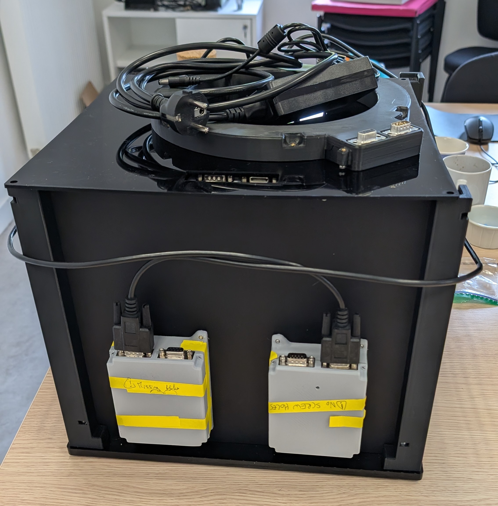

# Open-BEATBox

**Open-BEATBox** — **Open** — **BE**havioural and **A**u**T**onomous operant Box — is an open-source, modular, low-cost box that lets mice take part in behavioural tasks **inside their own home cage, day and night, with no experimenter in the room**. It delivers food rewards, shows images on two screens, senses what the animal does, and saves everything to files on your computer.



- 🌐 **Website:** <https://open-beatbox.github.io/>
- 📘 **Manual (start here):** <https://open-beatbox.github.io/docs/manual/>
- 🎥 **Assembly videos:** <https://www.youtube.com/@open-beatbox/>

> **This repository is the project's front door.** It contains the **website** and the machinery that publishes the **manual**. The designs, code and manual text live in their own repositories — [this page explains which is which](#where-is-everything).

---

## Start here: pick your path

| I am… | I want to… | Go to |
| --- | --- | --- |
| **Curious** | Understand what this is and how it works | [Overview](https://open-beatbox.github.io/docs/manual/overview.html) · [How it works](https://open-beatbox.github.io/docs/manual/how-it-works.html) |
| **A lab / technician** | **Build** a box | [Build guide](https://open-beatbox.github.io/docs/manual/build/index.html) · [Master BOM](https://github.com/Open-BeatBox/assembly-tutorials#bill-of-materials) · [Assembly tutorials](https://open-beatbox.github.io/docs/manual/build/assembly-tutorials/tutorials_index.html) |
| **A neuroscientist** | **Run experiments** with a box | [Getting started](https://open-beatbox.github.io/docs/manual/getting-started.html) · [Training stages](https://open-beatbox.github.io/docs/manual/software/stages.html) · [Your data](https://open-beatbox.github.io/docs/manual/software/data-output.html) |
| **An engineer** | Read the hardware, firmware and protocol | [Hardware](https://open-beatbox.github.io/docs/manual/hardware/index.html) · [Firmware](https://open-beatbox.github.io/docs/manual/software/firmware/index.html) · [CAN protocol](https://open-beatbox.github.io/docs/manual/software/firmware/can-intermodule-protocol.html) |
| **A contributor** | Fix or improve something | [Contributing](https://open-beatbox.github.io/docs/manual/contributing.html) · [Open points](https://open-beatbox.github.io/docs/manual/project/status.html) |
| **Stuck** | Solve a problem | [Troubleshooting](https://open-beatbox.github.io/docs/manual/troubleshooting.html) · [Glossary](https://open-beatbox.github.io/docs/manual/glossary.html) · [Discussions](https://github.com/Open-BeatBox/Open-BeatBox.github.io/discussions) |

---

## What Open-BEATBox is for

Short, experimenter-driven test sessions are a limitation in behavioural neuroscience: the animal is handled, moved to a test room, and tested for a few minutes. Open-BEATBox brings the task **to the animal**. Mice choose when to take part, across their own day–night rhythm, for days or weeks.

- **Less handling, less stress** — no transfer to a test room.
- **More data per animal** — many more trials, and learning and motivation curves over time.
- **Reproducible** — standard hardware, fixed task timing, automatic logs.
- **Modular and open** — feeder, screens, tunnel, lighting and nosepoke are separate modules; hardware, firmware, software and documentation are all open.

Intended uses: autonomous operant conditioning, reward-delivery and sensor-triggered tasks, longitudinal home-cage monitoring, circadian and motivational dynamics, and reproducible behavioural testing across laboratories.

## How it works, in one picture

```text
   ┌──────────┐      ┌───────────────────────────────┐      ┌─────────────┐      ┌──────────┐
   │  Mouse   │◄────►│   Modules                     │◄────►│ MAIN module │◄────►│  Your PC │
   │          │      │   feeder · screens · tunnel   │ CAN  │ (switch-    │serial│  control │
   │          │      │   lighting · nosepoke         │ bus  │  board)     │      │  app     │
   └──────────┘      └───────────────────────────────┘      └─────────────┘      └────┬─────┘
    behaviour          sensors + motors, each with a         translates               ▼
                       small computer of its own             and forwards         CSV result files
```

1. The mouse walks through a **tunnel**, looks at two **screens**, touches one, and collects a **pellet** from the **feeder**.
2. Each **module** senses and acts on its own and announces events on a shared cable (the **CAN bus**).
3. The **main module** is the only module connected to your PC. It forwards messages; it does not run the experiment.
4. The **PC application** runs the training protocol and writes every event to **CSV files** you can open in Excel, R or Python.

The full explanation, one trial step by step, is in [How it works](https://open-beatbox.github.io/docs/manual/how-it-works.html).

## From nothing to a first experiment

1. **Plan** — read the [safety notes](https://open-beatbox.github.io/docs/manual/build/safety.html) and download the [Master BOM](https://github.com/Open-BeatBox/assembly-tutorials#bill-of-materials).
2. **Order and make the parts** — circuit boards from a PCB service, 3D-printed and laser-cut parts ([fabrication](https://open-beatbox.github.io/docs/manual/build/fabrication.html)).
3. **Flash the boards** — [put the firmware on each module board](https://open-beatbox.github.io/docs/manual/hardware/flashing-cards.html) before closing it into its housing.
4. **Assemble the modules** — six [tutorials](https://open-beatbox.github.io/docs/manual/build/assembly-tutorials/tutorials_index.html), one video each.
5. **Integrate and power up** — [first power-up and test](https://open-beatbox.github.io/docs/manual/build/first-power-up.html).
6. **Install the PC application** — [installation](https://open-beatbox.github.io/docs/manual/software/install.html).
7. **Run** — [using the application](https://open-beatbox.github.io/docs/manual/software/pc-app.html), [stages S1–S4](https://open-beatbox.github.io/docs/manual/software/stages.html).

You do **not** need to be a programmer. You do need basic hand tools, and **some soldering** for the screen and infrared-sensor boards.

---

## Where is everything?

Open-BEATBox is published as several repositories, one per layer, each under the licence that fits it.

| Layer | Repository | What you will find | Licence |
| --- | --- | --- | --- |
| **Website** *(this repository)* | [Open-BeatBox.github.io](https://github.com/Open-BeatBox/Open-BeatBox.github.io) | The public website; the pipeline that builds and publishes the manual | AGPL-3.0 |
| **Documentation** | [Open-BeatBox_Documentation](https://github.com/Open-BeatBox/Open-BeatBox_Documentation) | The manual (Sphinx source), notes, media | CC-BY-4.0 |
| **Build guides** | [assembly-tutorials](https://github.com/Open-BeatBox/assembly-tutorials) | Per-module assembly tutorials and the Master BOM | see repository |
| **Hardware** | [Open-BeatBox_Hardware](https://github.com/Open-BeatBox/Open-BeatBox_Hardware) | CAD, enclosure, KiCad circuit boards, manufacturing files | CERN-OHL-S-2.0 |
| **Software** | [Open-BeatBox_Software](https://github.com/Open-BeatBox/Open-BeatBox_Software) | PC application, module firmware (MicroPython), test command-line tool | AGPL-3.0 |
| **Firmware** | [Open-BeatBox_Firmware](https://github.com/Open-BeatBox/Open-BeatBox_Firmware) | Reserved for stand-alone firmware releases — *no source published there yet; the firmware is in the Software repository* | GPL-3.0 |

```text
Open-BeatBox.github.io  (this repository)
  ├── site/                  the website (Next.js)
  └── docs/  ─────────────►  Open-BeatBox_Documentation   (Git submodule)
                                └── source/build/assembly-tutorials/ ─► assembly-tutorials  (nested submodule)

Open-BeatBox_Hardware · Open-BeatBox_Software · Open-BeatBox_Firmware
        └── independent repositories, linked from the manual and the website
```

[More about the repositories, licences and versions →](https://open-beatbox.github.io/docs/manual/project/repositories.html)

## Project status

Open-BEATBox is a **working platform under active development**: boxes have been built and the tutorials are in use, but the software is a development version, and cost figures, protocol templates and some details are still being validated. The manual keeps an honest [list of open points](https://open-beatbox.github.io/docs/manual/project/status.html).

---

## For maintainers of this repository

*You only need this section if you edit the website or publish the manual. Everyone else can stop reading here.*

### What is in this repository

```text
Open-BeatBox.github.io/
├── README.md                  this file
├── LICENSE, CITATION.cff      licence and citation information
├── package.json               root helper scripts
├── .gitmodules                declares the docs/ submodule
├── docs/                      submodule → Open-BeatBox_Documentation (the manual source)
├── scripts/build-docs.ps1     local Sphinx build helper (Windows)
├── site/                      the website
│   ├── content/               Markdown content of every page — edit this, no coding needed
│   ├── public/                images, videos, presentations; the built manual lands in public/docs/manual/
│   ├── src/                   website code (Next.js / React)
│   └── README.md              website developer notes
├── resources/                 forwarding notes only — the content moved to the repositories above
└── .github/workflows/         ci.yml (checks on pull requests), deploy-site.yml (publishing)
```

### Editing the website text

Every page is a Markdown file in [`site/content/`](./site/content) with a small header (title, hero text, sections). Edit the text, preview it, and open a pull request — see [`site/README.md`](./site/README.md) for the content model.

### Updating the manual

1. Change the manual in the **Documentation** repository (its `source/` folder), and merge it there.
2. In this repository, move the submodule pointer to the new version and review it:

   ```bash
   git submodule update --remote --recursive docs
   git diff --submodule
   git add docs && git commit -m "Update documentation"
   ```

3. Push. The deployment workflow rebuilds the manual and the website together.

Update the pointer only after the change has been reviewed. To pull **assembly tutorials** changes, update the nested submodule in the Documentation repository first.

### Run everything on your computer

Clone **with submodules** (the manual does not build without them):

```bash
git clone --recurse-submodules https://github.com/Open-BeatBox/Open-BeatBox.github.io.git
cd Open-BeatBox.github.io
# if you cloned without --recurse-submodules:
git submodule update --init --recursive
```

Preview the website (Node.js 20):

```bash
cd site
npm install
npm run dev          # then open http://localhost:3000
```

Build the manual (Python 3.10+):

```bash
python -m pip install -r docs/requirements.txt
python -m sphinx -b html -d docs/_build/doctrees docs/source site/public/docs/manual
```

On Windows, `npm run build:docs` runs the same command. Build the manual **and** the website together with `npm run build:all` from the repository root.

The manual should build with **no warnings**: the pull-request check (`ci.yml`) treats warnings as errors.

### Deployment

`.github/workflows/deploy-site.yml` builds the Sphinx manual into `site/public/docs/manual/`, builds the static website, and publishes `site/out` to the `gh-pages` branch when `site/`, `docs/`, or the workflow changes on `main`.

While the Documentation repository is private, the workflow needs a repository secret named `DOCS_TOKEN` (a token with read access to it); it falls back to the default token once that repository is public.

---

## Licensing

Open-BEATBox uses layer-specific open licences:

- **Website and software:** GNU AGPLv3 — [`LICENSE`](./LICENSE) here and in [Open-BeatBox_Software](https://github.com/Open-BeatBox/Open-BeatBox_Software).
- **Firmware:** GNU GPLv3 — [Open-BeatBox_Firmware](https://github.com/Open-BeatBox/Open-BeatBox_Firmware).
- **Hardware:** CERN OHL-S v2 (strongly reciprocal) — [Open-BeatBox_Hardware](https://github.com/Open-BeatBox/Open-BeatBox_Hardware).
- **Documentation:** CC-BY-4.0 — [Open-BeatBox_Documentation](https://github.com/Open-BeatBox/Open-BeatBox_Documentation).

Each repository carries its own `LICENSE` file, which is authoritative for that layer.

## Citing Open-BEATBox

Each repository has a `CITATION.cff` file, so GitHub's **Cite this repository** button gives you APA and BibTeX. A reference paper is in preparation; once it is published it will become the preferred citation.

## Contributing

Contributions of every size are welcome. The [contributing guide](https://open-beatbox.github.io/docs/manual/contributing.html) explains which repository takes which contribution. Questions and ideas: [Discussions](https://github.com/Open-BeatBox/Open-BeatBox.github.io/discussions). Website tasks: [`site/BEATBOX_IMPACT_REDESIGN_TODO.md`](./site/BEATBOX_IMPACT_REDESIGN_TODO.md).

## Contact

Eric Burguière — [eric.burguiere@cnrs.fr](mailto:eric.burguiere@cnrs.fr) — Centre de Recherche en Neurosciences de Lyon (CRNL), Centre Hospitalier Le Vinatier, Bron, France.
